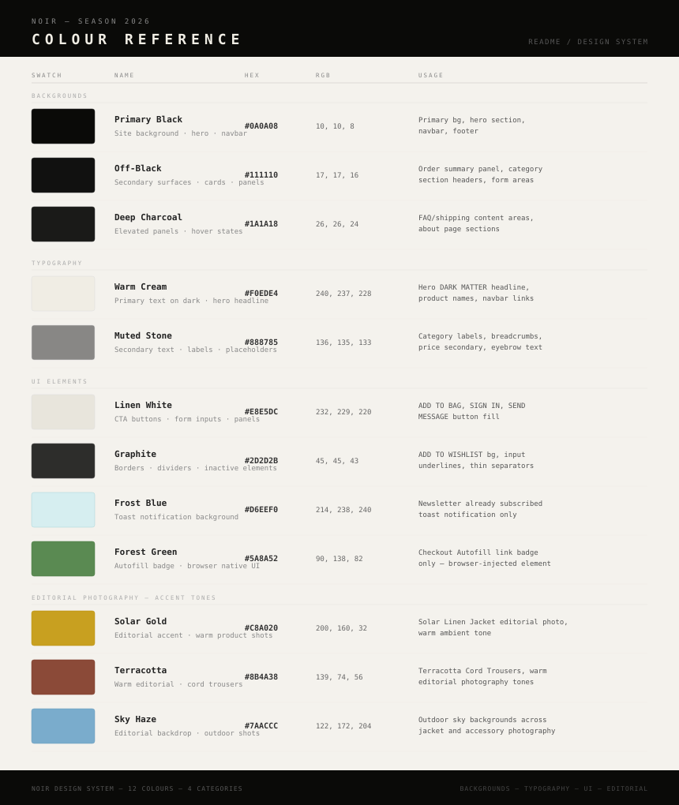

# NOIR — Premium Menswear E-Commerce Store


> **Live Site:** [noir-store-pp5.herokuapp.com](https://noir-store-pp5-a76b3f8c9d2e.herokuapp.com)
> **GitHub Repository:** [github.com/oliveiracle/noir-store](https://github.com/oliveiracle/noir-store)

---

## Table of Contents

1. [Project Overview](#1-project-overview)
2. [UX Design](#2-ux-design)
   - [Strategy](#strategy)
   - [Target Audience](#target-audience)
   - [User Stories](#user-stories)
   - [Design Inspiration](#design-inspiration)
   - [Colour Palette](#colour-palette)
   - [Typography](#typography)
   - [Wireframes](#wireframes)
3. [Features](#3-features)
4. [Technologies Used](#4-technologies-used)
5. [Database Design](#5-database-design)
6. [Agile Development](#6-agile-development)
7. [Marketing & SEO](#7-marketing--seo)
8. [Testing](#8-testing)
9. [Deployment](#9-deployment)
10. [Credits](#10-credits)

---

## 1. Project Overview

NOIR is a full-stack e-commerce web application built with Django for Code Institute's Portfolio Project 5. It is a fictional premium menswear brand selling jackets, trousers, shirts, t-shirts and accessories.

The project demonstrates a complete B2C e-commerce flow: product browsing, user authentication, shopping bag, Stripe payment integration, order confirmation emails, user profiles with order history, a wishlist, product reviews, and a newsletter subscription system.

The aesthetic is intentionally minimal and editorial — dark backgrounds, restrained typography, and generous negative space. The brand name "NOIR" (French for black) reflects the visual identity of the store.

---

## 2. UX Design

### Strategy

The goal of NOIR is to offer a premium shopping experience that feels as refined as the products being sold. Every design decision — from the colour palette to the typography — is driven by the brand identity: *no excess, no noise*.

The site needs to be:
- Easy to navigate for first-time visitors
- Fast and responsive across all devices
- Trustworthy enough to complete a purchase
- Visually distinctive in a saturated menswear market

### Target Audience

- Men aged 25–45 interested in premium, minimalist fashion
- Users who value design and brand identity over price
- Shoppers comfortable buying clothing online

### User Stories

User stories were tracked using GitHub Projects (Kanban board). They are grouped into must-have, should-have and could-have categories following MoSCoW prioritisation.

| ID | User Story | Priority |
|----|-----------|----------|
| US01 | As a visitor, I can browse all products so I can explore the collection | Must |
| US02 | As a visitor, I can filter products by category so I can find what I'm looking for | Must |
| US03 | As a visitor, I can search for products by name or description | Must |
| US04 | As a visitor, I can view a product detail page with image, price and description | Must |
| US05 | As a visitor, I can add a product to my shopping bag | Must |
| US06 | As a visitor, I can view my shopping bag with items and totals | Must |
| US07 | As a visitor, I can update or remove items from my bag | Must |
| US08 | As a visitor, I can complete a purchase using Stripe | Must |
| US09 | As a visitor, I can receive an order confirmation page | Must |
| US10 | As a visitor, I can receive an order confirmation email | Must |
| US11 | As a visitor, I can register for an account | Must |
| US12 | As a registered user, I can sign in and out | Must |
| US13 | As a registered user, I can reset my password | Must |
| US14 | As a registered user, I can save my default delivery info | Must |
| US15 | As a registered user, I can view my order history | Must |
| US16 | As an admin, I can add new products via the frontend | Must |
| US17 | As an admin, I can edit existing products | Must |
| US18 | As an admin, I can delete products | Must |
| US19 | As a visitor, I can sign up for the newsletter | Must |
| US20 | As a registered user, I can leave a review on a product | Should |
| US21 | As a registered user, I can edit or delete my own review | Should |
| US22 | As a registered user, I can add products to a wishlist | Should |
| US23 | As a visitor, I can use the NOIR Assistant chat widget | Could |
| US24 | As a visitor, I can view the About page with brand story | Should |
| US25 | As a visitor, I can see NOIR's Facebook Business Page evidence | Must |
| US26 | As a visitor, I can view FAQ, Shipping and Returns pages | Should |
| US27 | As a visitor, I can contact the store via the Contact page | Should |
| US28 | As a developer, I have deployed the site to Heroku | Must |
| US29 | As a developer, I have set up AWS S3 for static and media files | Must |
| US30 | As a developer, I have written a full README | Must |

---

### Design Inspiration

NOIR draws its visual identity from three sources:

**1. High-fashion editorial design**
The layout borrows from luxury fashion lookbooks — full-bleed imagery, oversized typography, generous white space (here, *black* space), and minimal UI chrome. Brands like Bottega Veneta, Rick Owens and Acne Studios were reference points.

**2. Brutalist web design**
The use of all-caps text, tight letter-spacing, thin dividers and no decorative elements reflects a restrained brutalism — form follows function, but with precision.

**3. Space and cosmos aesthetics**
The hero section features a hand-coded canvas animation: a parallax starfield, animated nebulae, a rotating galaxy, a black hole with an accretion disc and orbital particles, and periodic shooting stars. The title "DARK MATTER" and the brand concept of silence and restraint are metaphors for the void — something present but unseen.

The About page extends this metaphor through a typewriter animation that reveals four brand chapters, one character at a time, accompanied by an optional mechanical keyboard sound effect.

---

### Colour Palette

The palette is built around blacks and warm off-whites, with a single gold accent. Every shade has a specific role in the hierarchy.



| Variable | Hex | Role |
|----------|-----|------|
| `--black` | `#000000` | Page background |
| `--off-black` | `#0a0a0a` | Alternate background |
| `--dark` | `#111111` | Card backgrounds |
| `--cement` | `#1c1c1c` | Borders, dividers |
| `--mid` | `#333333` | Muted UI elements |
| `--sand` | `#888068` | Secondary text, labels |
| `--bone` | `#c8c0b0` | Body text on dark backgrounds |
| `--white` | `#f0ede8` | Primary text, headings |
| `--accent` | `#c9a96e` | Gold — CTAs, highlights, hover states |

The palette is intentionally warm rather than clinical. Pure white (`#ffffff`) is never used — `--white` at `#f0ede8` adds warmth and avoids the harshness of a cold monochrome.

The single accent colour `--accent` (`#c9a96e`) is used sparingly — it appears on hover states, CTA buttons and the hero animation — creating a focal point without noise.

---

### Typography

NOIR uses two typefaces with clearly defined roles:

#### Montserrat — Primary Typeface
- **Used for:** Navigation, headings, labels, buttons, all UI text
- **Weights:** 300 (light), 400 (regular), 600 (semibold), 700 (bold), 900 (black)
- **Why Montserrat:** Its geometric, clean construction is ideal for all-caps display text. At high letter-spacing and 900 weight, it achieves the editorial boldness required by the brand.

#### Cormorant Garamond — Secondary Typeface
- **Used for:** Brand tagline ("Premium menswear. No excess. No noise."), editorial body text, footer tagline
- **Weights:** 300 (light), 400 (regular), 600 (semibold)
- **Why Cormorant Garamond:** A refined high-contrast serif that contrasts with Montserrat's geometric neutrality. It references the heritage of fashion publishing — the typefaces found in Vogue, Dazed and System Magazine.

#### Type Scale Principles
- All UI labels are set in caps with `letter-spacing: 0.1em` to `0.45em`
- The hero title uses weight 900 at approximately 18vw — intentionally oversized
- Body text uses weight 300 at `line-height: 1.7` for readability against dark backgrounds
- No italic text is used anywhere — consistency over decoration

---

### Wireframes

Wireframes were created in SVG format for both desktop and mobile layouts before development began. They cover all major page types.

#### Desktop Wireframes

| Page | Wireframe |
|------|-----------|
| Homepage — Hero | [View](wireframes/desktop/wireframe_noir_01_homepage_hero.svg) |
| Homepage — Grid + Footer | [View](wireframes/desktop/wireframe_noir_03_homepage_grid_footer.svg) |
| About — The Origin | [View](wireframes/desktop/wireframe_noir_04_about_origin.svg) |
| Category — Accessories | [View](wireframes/desktop/wireframe_noir_07_category_accessories.svg) |
| FAQ | [View](wireframes/desktop/wireframe_noir_08_faq.svg) |
| Shipping | [View](wireframes/desktop/wireframe_noir_09_shipping.svg) |
| Contact | [View](wireframes/desktop/wireframe_noir_10_contact.svg) |
| Sign In | [View](wireframes/desktop/wireframe_noir_11_sign_in.svg) |
| Product Detail | [View](wireframes/desktop/wireframe_noir_12_product_detail.svg) |
| Shopping Cart | [View](wireframes/desktop/wireframe_noir_13_cart.svg) |
| Checkout | [View](wireframes/desktop/wireframe_noir_14_checkout.svg) |
| Wishlist | [View](wireframes/desktop/wireframe_noir_15_desktop_wishlist.svg) |

#### Mobile Wireframes

| Page | Wireframe |
|------|-----------|
| Shop All | [View](wireframes/mobile/wireframe_noir_M01_mobile_shop_all.svg) |
| About | [View](wireframes/mobile/wireframe_noir_M02_mobile_about.svg) |
| Accessories + Chat | [View](wireframes/mobile/wireframe_noir_M03_mobile_accessories_chat.svg) |
| Cart | [View](wireframes/mobile/wireframe_noir_M04_mobile_cart.svg) |
| Checkout | [View](wireframes/mobile/wireframe_noir_M05_mobile_checkout.svg) |
| Change Password | [View](wireframes/mobile/wireframe_noir_M06_mobile_change_password.svg) |
| Wishlist | [View](wireframes/mobile/wireframe_noir_M07_mobile_wishlist.svg) |
| Sign Out | [View](wireframes/mobile/wireframe_noir_M07_mobile_sign_out.svg) |
| Sign In | [View](wireframes/mobile/wireframe_noir_M08_mobile_sign_in.svg) |
| Empty Cart + Toast + Footer | [View](wireframes/mobile/wireframe_noir_M09_mobile_empty_cart_toast_footer.svg) |

---

## 3. Features

### Existing Features

#### Navigation
- Fixed top navbar with logo, category links, search bar, account dropdown and bag icon
- Responsive mobile nav with hamburger toggle
- Bag item count badge updates dynamically
- Skip-to-content link for keyboard accessibility

#### Homepage
- Full-screen hero with animated HTML5 canvas starfield (parallax, nebulae, galaxy, black hole, shooting stars)
- Gravity letter effect on the hero title — letters repel from the cursor
- Horizontal scrolling product strip with drag interaction
- New Arrivals grid showing up to 4 products marked as `is_new`

#### Products
- All products page with category sidebar filter
- Products grouped by category in the default view
- Search by name or description
- Product detail page with image, price, rating, description, size selector
- NEW badge on new arrivals
- Admin users see Edit / Delete links on product pages

#### Shopping Bag
- Add, update and remove products
- Quantity clamped between 1 and 99 (security)
- Session-based bag persists across pages
- Order summary with subtotal and delivery calculation

#### Checkout
- Stripe PaymentIntent integration
- Pre-filled form for authenticated users with saved delivery info
- Real-time card validation via Stripe Elements
- Stripe webhook handler for payment confirmation fallback
- Order confirmation page after successful payment
- Order confirmation email sent to customer

#### User Accounts (via django-allauth)
- Register, sign in, sign out
- Password reset via email
- Change password
- User profile with default delivery info
- Order history with line items
- Wishlist section on profile page

#### Reviews
- Authenticated users can leave one review per product (1–5 stars + comment)
- Users can edit or delete their own review
- Reviews displayed under each product detail page

#### Wishlist
- Toggle products in/out of wishlist from product detail page
- Wishlist displayed as a product grid on the profile page

#### NOIR Assistant (Chat Widget)
- Fixed-position chat widget on every page
- Keyword-based rule engine for shipping, returns, sizing, payment queries
- Product search fallback — finds matching products by name or category
- Smooth open/close animation with focus management

#### Newsletter
- Email subscription form in the footer
- Stores unique emails in the database
- Duplicate signups handled gracefully

#### Information Pages
- About (animated typewriter with sound on desktop, static on mobile)
- FAQ, Shipping, Returns, Contact (with Google Maps embed)
- Facebook Business Page evidence at `/facebook/`
- Custom 404 page

#### Admin Panel
- Full Django admin for all models
- Store owners can add, edit and delete products via the frontend UI
- Orders, line items, reviews, wishlists and newsletter subscribers visible in admin

---

## 4. Technologies Used

### Languages
- Python 3.14
- HTML5
- CSS3
- JavaScript (ES6)

### Frameworks & Libraries
- Django 6.0.4
- Bootstrap 5.3
- Stripe.js v3
- Font Awesome 6.4
- Google Fonts (Montserrat, Cormorant Garamond)

### Django Packages
| Package | Purpose |
|---------|---------|
| django-allauth | User authentication, registration, password reset |
| django-crispy-forms | Form rendering with Bootstrap 5 |
| stripe | Stripe payment processing |
| boto3 | AWS S3 integration (production) |
| whitenoise | Static file serving |
| Pillow | Image upload handling |

### Tools & Services
- Git & GitHub — version control
- GitHub Projects — Agile Kanban board
- Heroku — cloud deployment
- AWS S3 — static and media file storage (production)
- Stripe — payment processing
- SQLite — local development database
- PostgreSQL — production database (Heroku)

---

## 5. Database Design

### Entity Relationship Diagram

The project uses the following custom models alongside Django's built-in User model:

#### Category
| Field | Type |
|-------|------|
| name | CharField |
| friendly_name | CharField |

#### Product
| Field | Type |
|-------|------|
| category | ForeignKey → Category |
| sku | CharField |
| name | CharField |
| description | TextField |
| price | DecimalField |
| rating | DecimalField |
| image | ImageField |
| is_new | BooleanField |

#### Review
| Field | Type |
|-------|------|
| product | ForeignKey → Product |
| user | ForeignKey → User |
| rating | IntegerField (1–5) |
| comment | TextField |
| created_at | DateTimeField |

*Constraint: unique_together (product, user) — one review per user per product*

#### Order
| Field | Type |
|-------|------|
| order_number | CharField (UUID) |
| full_name, email, phone_number | CharField/EmailField |
| street_address1/2, town_or_city, postcode, country, county | CharField |
| date | DateTimeField |
| delivery_cost, order_total, grand_total | DecimalField |
| stripe_pid | CharField |

#### OrderLineItem
| Field | Type |
|-------|------|
| order | ForeignKey → Order |
| product | ForeignKey → Product |
| quantity | IntegerField |
| lineitem_total | DecimalField (auto-calculated) |

#### UserProfile
| Field | Type |
|-------|------|
| user | OneToOneField → User |
| phone_number | CharField |
| street_address1/2, town_or_city, postcode, country, county | CharField |

#### Wishlist
| Field | Type |
|-------|------|
| user | OneToOneField → User |
| products | ManyToManyField → Product |

#### NewsletterSubscriber
| Field | Type |
|-------|------|
| email | EmailField (unique) |
| subscribed_at | DateTimeField |

---

## 6. Agile Development

This project was developed using Agile methodology. A GitHub Projects Kanban board (Project #11) was used to track all user stories through the following columns:

- **Backlog** — stories identified but not yet started
- **In Progress** — currently being worked on
- **Done** — completed and tested

User stories were written with acceptance criteria and prioritised using MoSCoW:
- **Must Have** — core e-commerce functionality
- **Should Have** — features that add significant value
- **Could Have** — nice-to-have features

The board can be viewed at: [github.com/oliveiracle/noir-store/projects](https://github.com/oliveiracle/noir-store/projects)

---

## 7. Marketing & SEO

### SEO

- Descriptive `<meta name="description">` on every page (overridable per page via template blocks)
- `<meta name="keywords">` with relevant menswear terms
- Open Graph meta tags for social sharing previews
- `robots.txt` dynamically served at `/robots.txt`
- XML sitemap dynamically generated at `/sitemap.xml` covering all products and static pages
- Semantic HTML — proper heading hierarchy (`h1` → `h2` → `h3`)
- All images have descriptive `alt` attributes
- External links use `rel="noopener noreferrer nofollow"`

### Social Media Marketing

A real Facebook Business Page was created for NOIR Store as evidence of social media marketing strategy:

- **Page name:** NOIR Store
- **Category:** Apparel & Clothing
- **Bio:** Premium menswear. Crafted for those who speak through silence. Shop at noir-store.com

Screenshots of the Facebook Business Page are available at `/facebook/` on the live site.


### Email Marketing

A newsletter subscription system is built into the footer of every page. Subscribers are stored in the database and visible in the Django admin panel. The system uses `get_or_create` to handle duplicate signups gracefully.

---

## 8. Testing

### Manual Testing

Full manual testing was carried out across all user stories. See [TESTING.md](TESTING.md) for detailed results.

### Validator Testing

| Tool | Result |
|------|--------|
| W3C HTML Validator | Pass — No errors |
| W3C CSS Validator | Pass — No errors |
| JSHint | Pass — ES6 configured via `.jshintrc` |
| PEP8 / flake8 | Pass — Zero errors (max line length 79) |

### Browser Testing

| Browser | Result |
|---------|--------|
| Chrome 145 | ✅ Pass |
| Safari (iOS) | ✅ Pass |
| Firefox | ✅ Pass |

### Responsiveness Testing

Tested on:
- iPhone (Safari mobile)
- Desktop 1440px+
- Tablet (Chrome DevTools)

### Accessibility

- Skip-to-content link on every page
- All form inputs have associated `<label>` elements (visually hidden where appropriate)
- All icon-only buttons have `aria-label` attributes
- `aria-hidden="true"` on decorative icons
- Colour contrast checked against WCAG AA standards
- `aria-live="polite"` on dynamic content regions

---

## 9. Deployment

### Local Development

1. Clone the repository:
```bash
git clone https://github.com/oliveiracle/noir-store.git
cd noir-store
```

2. Create a virtual environment and install dependencies:
```bash
python -m venv venv
source venv/bin/activate
pip install -r requirements.txt
```

3. Create a `.env` file with the following variables:
```
SECRET_KEY=your_secret_key
STRIPE_PUBLIC_KEY=your_stripe_public_key
STRIPE_SECRET_KEY=your_stripe_secret_key
STRIPE_WH_SECRET=your_stripe_webhook_secret
```

4. Run migrations and start the server:
```bash
python manage.py migrate
python manage.py runserver
```

### Heroku Deployment

1. Create a new Heroku app
2. Add the Heroku Postgres add-on
3. Set all environment variables in Heroku Config Vars:
   - `SECRET_KEY`
   - `STRIPE_PUBLIC_KEY`
   - `STRIPE_SECRET_KEY`
   - `STRIPE_WH_SECRET`
   - `AWS_ACCESS_KEY_ID`
   - `AWS_SECRET_ACCESS_KEY`
   - `USE_AWS` = `True`
   - `EMAIL_HOST_USER`
   - `EMAIL_HOST_PASSWORD`
4. Push to Heroku:
```bash
git push heroku main
```
5. Run migrations on Heroku:
```bash
heroku run python manage.py migrate
```

### AWS S3 Setup

1. Create an S3 bucket with public access enabled
2. Create an IAM user with S3 permissions
3. Add `AWS_ACCESS_KEY_ID`, `AWS_SECRET_ACCESS_KEY` and `AWS_STORAGE_BUCKET_NAME` to Heroku Config Vars
4. Set `USE_AWS=True` — the app will automatically use S3 for static and media files

---

## 10. Credits

### Code

- Stripe integration pattern based on [Code Institute's Boutique Ado walkthrough](https://github.com/Code-Institute-Solutions/boutique_ado_v1)
- Django allauth documentation for authentication setup
- Django documentation for signals, context processors and model design

### Media

- Product images sourced from [Unsplash](https://unsplash.com) — free to use under the Unsplash licence
- Mechanical keyboard sound effect from [Freesound.org](https://freesound.org) (CC0 licence)

### Design References

- [Bottega Veneta](https://www.bottegaveneta.com) — editorial layout and negative space
- [Acne Studios](https://www.acnestudios.com) — minimalist brand identity

### Acknowledgements

- My mentor at Code Institute for guidance throughout the project
- The Code Institute Slack community for support
- Code Institute tutors for technical assistance

---

*This project was created as part of the Code Institute Full Stack Software Development Diploma — Portfolio Project 5 (E-Commerce Applications).*
